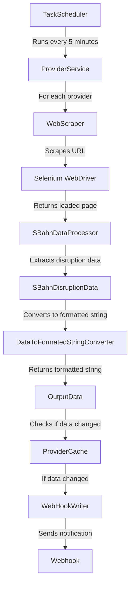

### Public Transport Disruption Notifier

This app runs a scheduled task that scrapes data from the S-Bahn Berlin website
and notifies users about disruptions via webhook.

It uses a real browser to scrape the data and run JS scripts to load the
entire page and support SPAs.

Runs every 5 minutes by default

## Data Flow Diagram (Mermaid)

